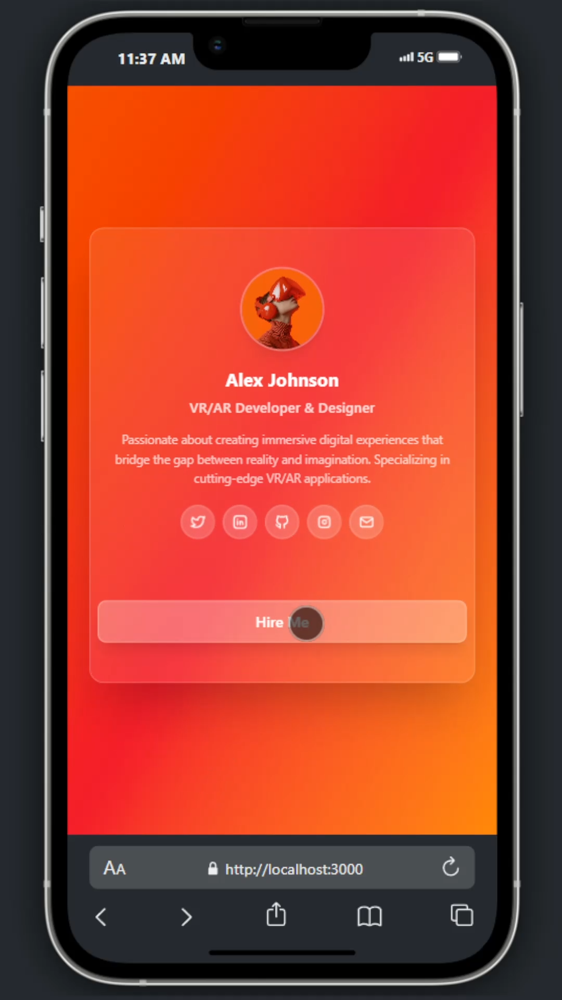

# 🌟 Glass Effect Card

A modern, reusable card component with a sleek **glassmorphism effect**.
Perfect for showcasing user profiles, team members, or personal portfolios.

---

## ✨ Features

- 🎨 Glassmorphism UI (blur + transparency)
- 📱 Fully responsive & customizable
- 🧩 Easy to integrate into any project
- 👤 Supports profile image, name, role, and social links
- ⚡ Lightweight and clean design

---

## 📸 Preview



---

## 🔧 Installation

```bash
# Clone this repo
git clone https://github.com/readyuicomponent/glass-card.git

# Navigate into the folder
cd glass-card

# Install with your package manager ( like npm, pnpm, yarn, etc. )
npm i
npm run dev
```
